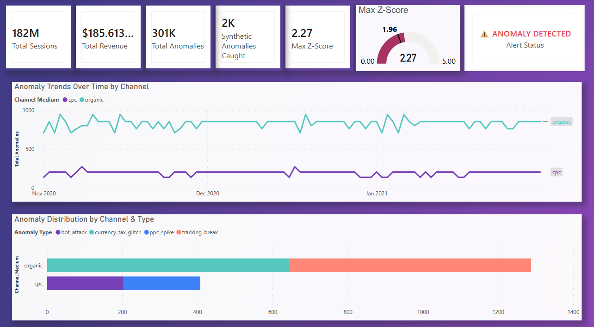
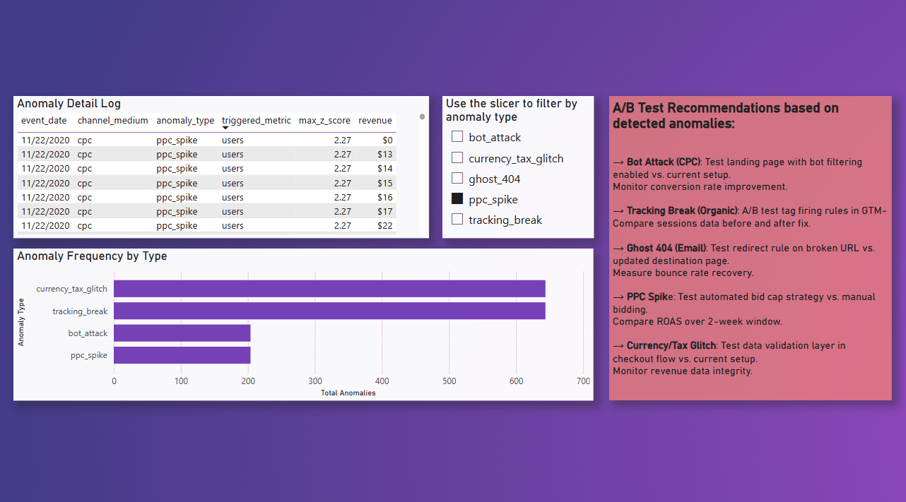

# SENTRY.mark 🛡️
### Automated Anomaly Detection Engine for Digital Marketing Data

> 🇮🇹 [Leggi in Italiano](README_IT.md)

---

> SENTRY.mark is an automated anomaly detection engine for digital marketing data. It monitors GA4 data from BigQuery, detects statistically significant deviations using rolling Z-Score baselines, classifies anomalies by business impact, and triggers real-time Slack alerts with a simulated budget protection layer. The goal is to move marketing analytics from passive reporting to active data integrity monitoring.

---

## The Problem

In digital marketing, **latency in detecting anomalies costs thousands of euros** in wasted budget and decisions based on corrupted data.

Standard reports are passive: they show the problem when it's already too late.

A bot attack drains your CPC budget silently. A broken tracking tag makes your campaigns invisible. A 404 on a landing page burns ad spend with zero return. By the time the weekly report arrives, the damage is done.

**SENTRY.mark was built to change that.**

---

## The Solution

SENTRY.mark is an automated **Watchdog Engine** for digital marketing data. It is not a dashboard — it is a statistical detection system that:

1. Queries raw GA4 data from Google BigQuery
2. Identifies statistically significant deviations using Z-Score modeling
3. Classifies anomalies by type and business impact
4. Triggers real-time Slack alerts and simulates a Kill-Switch to stop ad spending
5. Visualizes everything in a Power BI executive dashboard

> **This project transforms the analyst from a passive observer of the past into an active guardian of business integrity.**

---

## Tech Stack

| Tool | Role | Why |
|---|---|---|
| Google BigQuery | Data Warehouse / GA4 source | Industry standard for large-scale analytics |
| SQL (Standard Dialect) | Data modeling with CTEs | Clean, structured, production-grade queries |
| Python (Pandas, SciPy) | Statistical engine | Rolling Z-Score and alert logic |
| Power BI (PL-300) | Executive dashboard | Enterprise reporting layer |
| Slack Webhooks | Real-time alerting | Immediate operational notification |
| GitHub Actions | Automation / CI-CD | Scheduled pipeline execution — no human trigger needed |

---

## Architecture

```
┌─────────────────────────────────────┐
│           DATA LAYER                │
│  GA4 BigQuery Public Dataset        │
│         ↓                           │
│  SQL — CTE Transformation           │
│  ga4_daily_metrics                  │
│         +                           │
│  synthetic_anomalies (chaos eng.)   │
│         ↓                           │
│  fact_daily_metrics_enriched        │
└─────────────────────────────────────┘
                 ↓
┌─────────────────────────────────────┐
│         DETECTION LAYER             │
│  Python — Rolling Z-Score Engine    │
│  7-day window per channel           │
│  Severity scoring: MEDIUM/HIGH/CRIT │
│         ↓                           │
│  anomalies_detected.csv             │
└─────────────────────────────────────┘
                 ↓
┌─────────────────────────────────────┐
│        ACTIVATION LAYER             │
│  Alert Classifier → alerts.json     │
│  Kill-Switch Simulator              │
│  Slack Real-Time Notifications      │
│         ↓                           │
│  Power BI Executive Dashboard       │
└─────────────────────────────────────┘
```

---

## The Statistical Engine

### How Z-Score Works

The Z-Score measures how far a value deviates from its recent normal behavior.

```
Z = (observed value - rolling mean) / rolling standard deviation
```

**Why rolling mean and not global average?**
Digital traffic is not stationary — November and January behave differently. Using a 7-day rolling window means each day is compared to its own recent context, not to a seasonal average. This is the same principle used in industrial monitoring systems.

**The 1.96 threshold**
A Z-Score above 1.96 means the value falls outside 95% of normal cases — there is only a 5% probability it is random fluctuation. This is the standard threshold for a two-tailed hypothesis test at α = 0.05.

### Severity Bands

| Z-Score | Severity | Statistical Meaning |
|---|---|---|
| 1.96 – 3.0 | MEDIUM | Outside 95% of normal distribution |
| 3.0 – 4.0 | HIGH | Outside 99.7% — rare event |
| > 4.0 | CRITICAL | Statistically impossible by chance |

---

## Anomaly Catalog

### 🤖 Bot Attack
**What happens:** Sessions spike massively, conversion rate drops to 0%, bounce rate hits 100%.
**Business impact:** You are paying CPC/CPM for non-human traffic that will never convert. With a €10k/month budget, even 20% bot traffic means €2,000 wasted.
**Protocol:** IMMEDIATE ACTION — flag for spending review.

### 📡 Tracking Break
**What happens:** Sessions on an active channel drop to near zero. The signal disappears completely.
**Business impact:** Every optimization decision made while tracking is broken is based on false data. You shift budget to channels that appear to perform but don't.
**Protocol:** IMMEDIATE ACTION — verify GTM tag firing and GA4 data stream.

### 👻 Ghost 404
**What happens:** Normal traffic volume arrives, but revenue is zero and bounce rate is 100%.
**Business impact:** Every paid click lands on a broken page. The campaign budget keeps running; conversions are zero.
**Protocol:** IMMEDIATE ACTION — check landing page URL and redirect rules.

### 📈 PPC Spike
**What happens:** Sessions increase 300%+ without a proportional increase in revenue or conversions.
**Business impact:** A bid strategy error or platform bug is burning the daily budget in hours instead of 24h. You discover it at end of day — too late.
**Protocol:** WEEKLY REPORT — review bid strategy and ROAS impact.

### 💱 Currency / Tax Glitch
**What happens:** Purchase count is normal, but revenue is 10x the expected value.
**Business impact:** Management makes strategic decisions on inflated numbers — budget allocation, forecasts, targets — all based on corrupted data.
**Protocol:** IMMEDIATE ACTION — audit checkout data validation layer.

---

## Kill-Switch Simulator

The Kill-Switch activates only when **both** conditions are met:

1. The anomaly type is classified as a technical error (bot attack, ghost 404, tracking break)
2. Z-Score ≥ 3.0 — the event is outside 99.7% of normal cases

The double condition prevents false positives. You don't stop spending on a statistical fluctuation — only on a technically severe and statistically extreme event.

> **Note:** In this portfolio version, the kill-switch does not modify live advertising campaigns. It generates a decision log and a Slack alert with a suspension recommendation. In a production environment, this layer would be integrated with the Google Ads API behind a human-in-the-loop approval workflow.

---

## Dashboard

### Page 1 — Command Center
Real-time overview: KPI cards, Z-Score gauge with 1.96 alert threshold, anomaly trends over time by channel, and distribution by channel and type.



### Page 2 — Deep Dive
Operational drill-down: anomaly detail log with interactive slicer by type, anomaly frequency by type, and A/B test recommendations based on detected anomalies.



---

## Project Structure

```
sentry_mark/
├── data/
│   ├── raw/                    # Extracted BigQuery data (CSV)
│   ├── processed/              # Z-Score output with anomaly flags
│   └── anomalies/              # Alert JSON and kill-switch log
├── src/
│   ├── ingestion/
│   │   └── extract_bigquery.py # Connects to BigQuery and exports data
│   ├── detection/
│   │   └── zscore_engine.py    # Rolling Z-Score calculation engine
│   └── alerting/
│       ├── alert_classifier.py # Classifies anomalies by type and protocol
│       ├── kill_switch.py      # Evaluates spending halt conditions
│       └── slack_notifier.py   # Sends real-time Slack alerts
├── dashboard/
│   └── SENTRY.mark.pbix        # Power BI dashboard file
├── docs/
│   └── images/                 # Dashboard screenshots
├── .github/
│   └── workflows/
│       └── sentry_pipeline.yml # GitHub Actions automation
├── .env                        # Environment variables (not committed)
├── .gitignore
├── requirements.txt
└── README.md
```

---

## How to Run

### Prerequisites

- Python 3.10+
- Google Cloud account with BigQuery API enabled
- A BigQuery dataset with GA4 data (or use the public dataset `bigquery-public-data.ga4_obfuscated_sample_ecommerce`)
- Slack workspace with an Incoming Webhook configured
- Power BI Desktop

### 1. Clone the repository

```bash
git clone https://github.com/your-username/sentry-mark.git
cd sentry-mark
```

### 2. Create and activate virtual environment

```bash
python3 -m venv venv
source venv/bin/activate        # macOS / Linux
venv\Scripts\activate           # Windows
```

### 3. Install dependencies

```bash
pip install -r requirements.txt
```

### 4. Configure environment variables

Create a `.env` file in the root directory:

```
GOOGLE_APPLICATION_CREDENTIALS=./your-service-account-key.json
SLACK_WEBHOOK_URL=https://hooks.slack.com/services/xxx/yyy/zzz
```

To generate the service account key:
- Go to Google Cloud Console → IAM & Admin → Service Accounts
- Create a service account with roles: **BigQuery Data Viewer** + **BigQuery Job User**
- Download the JSON key and place it in the project root

### 5. Run the pipeline

```bash
# Step 1 — Extract data from BigQuery
python src/ingestion/extract_bigquery.py

# Step 2 — Run Z-Score anomaly detection
python src/detection/zscore_engine.py

# Step 3 — Classify anomalies
python src/alerting/alert_classifier.py

# Step 4 — Evaluate kill-switch conditions
python src/alerting/kill_switch.py

# Step 5 — Send Slack notifications
python src/alerting/slack_notifier.py
```

### 6. Open the dashboard

Open `dashboard/SENTRY.mark.pbix` in Power BI Desktop and refresh the data connection.

---

## Chaos Engineering — Synthetic Anomalies

To validate the detection engine, five synthetic anomalies were injected into real GA4 data using controlled SQL inserts. Each anomaly was designed to produce statistically extreme values on specific metrics:

| Anomaly | Date | Channel | Metric Triggered |
|---|---|---|---|
| Tracking Break | 2020-11-08 | Organic / Google | Sessions → 0 |
| Bot Attack | 2020-11-15 | CPC / Google | Sessions spike, CVR = 0% |
| PPC Spike | 2020-11-22 | CPC / Google | Sessions +300%, revenue flat |
| Ghost 404 | 2020-11-29 | Email / Newsletter | Revenue = 0, bounce = 100% |
| Currency/Tax Glitch | 2021-01-10 | Organic / Google | Revenue x10 |

All 5 anomalies were successfully detected by the Z-Score engine with `is_synthetic_anomaly = TRUE`.

---

## Limitations

This project uses a public obfuscated GA4 dataset and synthetic anomaly injection. It is designed as a portfolio-grade prototype, not as a fully deployed production monitoring system.

Known limitations:
- Rolling Z-Score assumes relatively stable metric distributions. In production, adaptive baselines or day-of-week seasonality correction would improve precision.
- Small-volume channels may produce noisy alerts due to limited data points in the rolling window.
- Bounce rate values are near zero due to dataset obfuscation — fully populated in a real GA4 environment.
- The kill-switch is simulated and does not modify live advertising campaigns.
- In production, human approval and Ads API governance would be required before any automated budget action.

---

## Production Roadmap

- Replace fixed Z-Score thresholds with adaptive baselines
- Add day-of-week seasonality correction (compare Mondays with Mondays)
- Add MAD / IQR robust anomaly detection for non-Gaussian distributions
- Add Google Ads API integration in read-only mode
- Add human approval workflow before campaign pausing
- Store anomaly history in BigQuery instead of local JSON
- Add dbt models for SQL transformation layer
- Add unit tests and CI validation
- Add Docker deployment
- Add Looker Studio version of the dashboard

---

## Notes on the Dataset

This project uses the `bigquery-public-data.ga4_obfuscated_sample_ecommerce` public dataset (Google Merchandise Store, Nov 2020 – Jan 2021).

This project was built as a portfolio case study to demonstrate applied analytics engineering for digital marketing anomaly detection.

---

## Target Roles

This project was built to demonstrate end-to-end competencies for:

- **Marketing Data Analyst**
- **Digital Analytics Specialist**
- **Junior Analytics Engineer**
- **Marketing Operations Analyst**
- **Growth Data Analyst**

Skills demonstrated: data extraction and modeling at scale (BigQuery + SQL), statistical analysis and anomaly detection (Python + SciPy), business logic implementation (alert classification, kill-switch simulator), executive communication (Power BI dashboard), production-ready automation (GitHub Actions).

---

## Author

**Francesca Monte**
Marketing Data Analyst | Digital Analytics | BigQuery | Power BI | Python

[LinkedIn](https://www.linkedin.com/in/francesca-monte/) · [GitHub](https://github.com/francescaetnom-wq)
